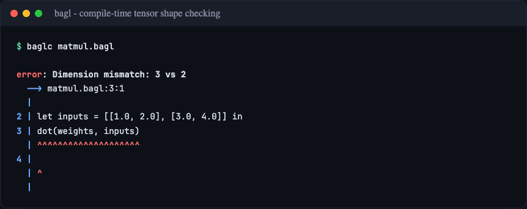
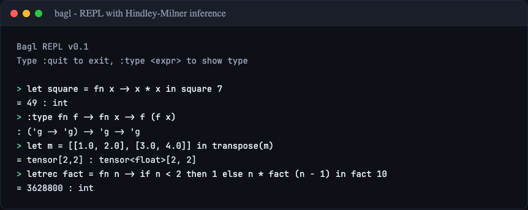
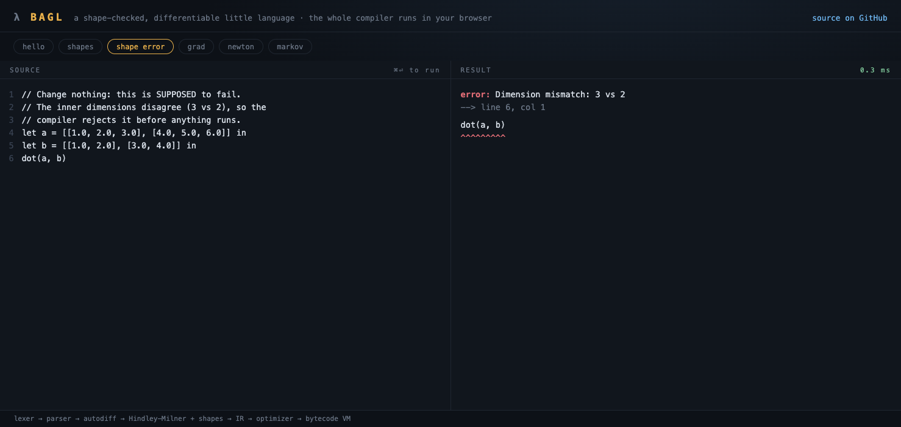

# BAGL

[](https://github.com/aibrahm/bagl/actions/workflows/ci.yml)


[](LICENSE)

A statically-typed functional programming language with first-class tensor support and compile-time shape checking.

**[Try it in your browser](https://aibrahm.github.io/bagl/playground/)** - the whole compiler runs client-side via js_of_ocaml. The **[language reference](https://aibrahm.github.io/bagl/reference/)** has editable, runnable examples, each verified in CI.

| Shape errors caught at compile time | REPL with Hindley-Milner inference |
|---|---|
|  |  |



## Features

- **Hindley-Milner Type Inference** - Full type inference with let-polymorphism
- **First-Class Tensors** - Native tensor types with compile-time dimension checking
- **Dimension Variables** - Polymorphic tensor operations with shape inference
- **Functional Core** - First-class functions, closures, and recursion
- **Automatic Differentiation** - `grad` rewrites scalar functions into derivatives and tensor losses into reverse-mode gradients at compile time
- **Element-wise Tensor Arithmetic** - `+ - * /` on same-shape tensors, with float scalar broadcast
- **Math Builtins** - `exp`, `log`, `sqrt`, `relu`, `step` on floats or element-wise on tensors, with derivative rules
- **Stack-Based VM** - Efficient bytecode execution
- **Bytecode Serialization** - Compile once, run anywhere with `.baglc` files
- **Browser Playground** - The full compiler compiled to 147 KB of JavaScript, [live here](https://aibrahm.github.io/bagl/playground/)

## Installation

Requires OCaml 5.2 (builds on 4.14+) and dune.

```bash
# Clone the repository
git clone https://github.com/aibrahm/bagl.git
cd bagl

# Build
dune build

# Run tests
dune test

# Install locally
dune install
```

## Usage

### REPL

```bash
dune exec baglc
```

```
Bagl REPL v0.1
Type :quit to exit, :type <expr> to show type

> let square = fn x -> x * x
square = <closure@1> : int -> int

> square 5
= 25 : int

> let df = grad (fn x -> x * x * x)
df = <closure@2> : float -> float

> df 2.0
= 12. : float

> :quit
```

Bindings persist across lines; `letrec`, closures, and `grad` all work
interactively.

### Run a File

```bash
dune exec baglc -- examples/hello.bagl
```

### Compile to Bytecode

```bash
dune exec baglc -- -c program.bagl -o program.baglc
dune exec baglc -- program.baglc
```

## Language Overview

### Basic Types

```
int       -- integers: 42, -17
float     -- floats: 3.14, -0.5
bool      -- booleans: true, false
string    -- strings: "hello"
```

Tensors are always float-backed, so tensor element types are `float`.

### Numeric Operators

Bagl has no type classes, so the arithmetic and comparison operators
(`+ - * /` and `< > <= >=`) are resolved by inspecting their operands:
if either side is a float the operation is float, otherwise it is int.
The rule is symmetric, so `x + 1.0` and `1.0 + x` behave identically.
When both operands are unconstrained the operation defaults to int, so
`fn x -> x + x` is inferred as `int -> int`. This trades full principal
types for a single-pass checker with no overloading machinery.

### Functions

Functions take a single parameter; multiple arguments are curried with
nested `fn`. Recursive bindings use `letrec`.

```ml
// Anonymous, curried functions
let add = fn x -> fn y -> x + y in add 2 3

// Recursive functions
letrec factorial = fn n ->
  if n <= 1 then 1
  else n * factorial (n - 1)
in factorial 5
```

### Tensors

```ml
// 1D tensor (vector) and 2D tensor (matrix)
let v = [1.0, 2.0, 3.0] in
let m = [[1.0, 2.0, 3.0], [4.0, 5.0, 6.0]] in

dot(m, v)                          -- matrix-vector product -> [2]
```

```ml
transpose([[1.0, 2.0], [3.0, 4.0]])   -- transpose -> [2, 2]
reshape([1.0, 2.0, 3.0, 4.0], [2, 2]) -- reshape   -> [2, 2]
```

### Math Builtins

`exp`, `log`, `sqrt`, `relu`, and `step` apply to a float, or element-wise
to a tensor. `step` is the Heaviside function (1.0 for x > 0, else 0.0)
and is also relu's derivative. `log` of a non-positive number and `sqrt`
of a negative number raise a runtime error rather than producing nan.

```ml
exp(1.0)                     // 2.71828...
relu([-1.0, 2.0, -3.0])      // [0, 2, 0]
grad (fn x -> exp(x * x)) 1.0  // 2e = 5.43656...
```

### Type Annotations

```ml
let x: int = 42 in
let f: int -> int = fn x -> x + 1 in
let t: tensor<float>[2, 3] = [[1.0, 2.0, 3.0], [4.0, 5.0, 6.0]] in
f x
```

### Tensor Type System

Tensor shapes are checked at compile time. `dot` unifies the shared
dimension, so an incompatible product is a type error before the program
ever runs:

```ml
// (2x3) . (3x2) type-checks and yields a (2x2)
let a = [[1.0, 2.0, 3.0], [4.0, 5.0, 6.0]] in
let b = [[1.0, 2.0], [3.0, 4.0], [5.0, 6.0]] in
dot(a, b)

// (2x3) . (2x2) is rejected: "Dimension mismatch: 3 vs 2"
```

Shape annotations may use dimension variables (written `'n`), which the
checker solves against concrete literals, e.g. `[1.0, 2.0, 3.0] : ['n]`.

### Automatic Differentiation

`grad (fn x -> body)` is a source-to-source transform. Before type
inference, it is rewritten into an ordinary Bagl function that computes
d(body)/dx using the sum, product, and quotient rules. The result is a
normal function, so it goes through inference, IR, optimization, and the
VM unchanged, and the derivative is type-checked like any other code.

```ml
// d/dx (x*x*x) = 3*x^2, so the derivative at x = 2 is 12
grad (fn x -> x * x * x) 2.0
```

It covers the scalar-float subset: literals, the parameter, `+ - * /`,
unary negation, `if` (each branch is differentiated, the condition is
data), and `let` (chained through). Differentiating through a function
call or `letrec` is reported as an error rather than silently returning
a wrong answer.

With a tensor parameter annotation, `grad` switches to reverse mode and
returns the gradient of a scalar loss with the parameter's shape:

```ml
// dL/dw = 2 X^T (Xw - y), derived by the compiler
let dloss = grad (fn w: tensor<float>[3] ->
  let e = dot(x, w) - y in
  dot(e, e)) in
w - 0.1 * dloss w
```

The tensor rules cover `dot` (matrix-matrix, matrix-vector, vector-vector),
`transpose`, element-wise arithmetic, the math builtins, scalar broadcast,
and `let`. A model can be trained entirely in Bagl: `examples/train_xor.bagl`
runs 200 steps of gradient descent on feature-mapped XOR and converges to
the exact solution `[1, 1, -2]`.

A `float`-annotated parameter can also be differentiated through tensor
code; the rank-1 sum-reductions this needs are expressed as dot products.
This is the pathwise derivative estimator from computational finance:

```ml
// d/ds of a Monte Carlo average, straight through relu and the payoff
let g = [0.8, 1.0, 1.2, 1.4] in
let ones = [1.0, 1.0, 1.0, 1.0] in
grad (fn s: float -> dot(relu(s * g - 1.0), ones) / 4.0) 1.0   // 0.65
```

Pullbacks Bagl cannot express (outer products, double reductions over
matrices) are compile errors, never wrong gradients.

## Project Structure

```
bagl/
├── src/
│   ├── location.ml    -- Source location tracking
│   ├── token.ml       -- Token definitions
│   ├── lexer.ml       -- Lexical analysis
│   ├── ast.ml         -- Abstract syntax tree
│   ├── parser.ml      -- Recursive descent parser
│   ├── autodiff.ml    -- Source-to-source automatic differentiation
│   ├── types.ml       -- Type definitions
│   ├── typeinfer.ml   -- Hindley-Milner inference
│   ├── ir.ml          -- Intermediate representation
│   ├── optimize.ml    -- IR optimization passes
│   ├── bytecode.ml    -- Bytecode definitions
│   ├── codegen.ml     -- Code generation
│   ├── serialize.ml   -- Bytecode serialization
│   ├── vm.ml          -- Virtual machine
│   └── errors.ml      -- Error handling
├── bin/
│   └── main.ml        -- CLI entry point
├── js/
│   └── bagl_js.ml     -- js_of_ocaml entry point for the browser playground
├── lsp/
│   └── lsp_main.ml    -- Language server (bagl-lsp)
├── editors/
│   └── vscode/        -- VS Code extension
├── examples/          -- Example programs
├── test/              -- Test suite
└── docs/
    └── language-spec/ -- Full language specification
```

## Editor Support

The `bagl-lsp` executable (built from `lsp/`) is a Language Server Protocol
server over stdio. It publishes compiler diagnostics as you type and shows
inferred types on hover for top-level bindings. A minimal VS Code client
lives in [editors/vscode/](editors/vscode/), whose README also covers
Neovim setup. Build and install the server with:

```bash
dune build
dune install   # puts bagl-lsp on your PATH
```

## Documentation

See [docs/language-spec/](docs/language-spec/) for the complete language specification:

1. [Introduction](docs/language-spec/01-introduction.md)
2. [Lexical Structure](docs/language-spec/02-lexical-structure.md)
3. [Grammar](docs/language-spec/03-grammar.md)
4. [Types](docs/language-spec/04-types.md)
5. [Expressions](docs/language-spec/05-expressions.md)
6. [Type Inference](docs/language-spec/06-type-inference.md)
7. [Tensor Semantics](docs/language-spec/07-tensor-semantics.md)
8. [Runtime](docs/language-spec/08-runtime.md)
9. [Bytecode Specification](docs/language-spec/09-bytecode-spec.md)

## License

MIT. See [LICENSE](LICENSE).
